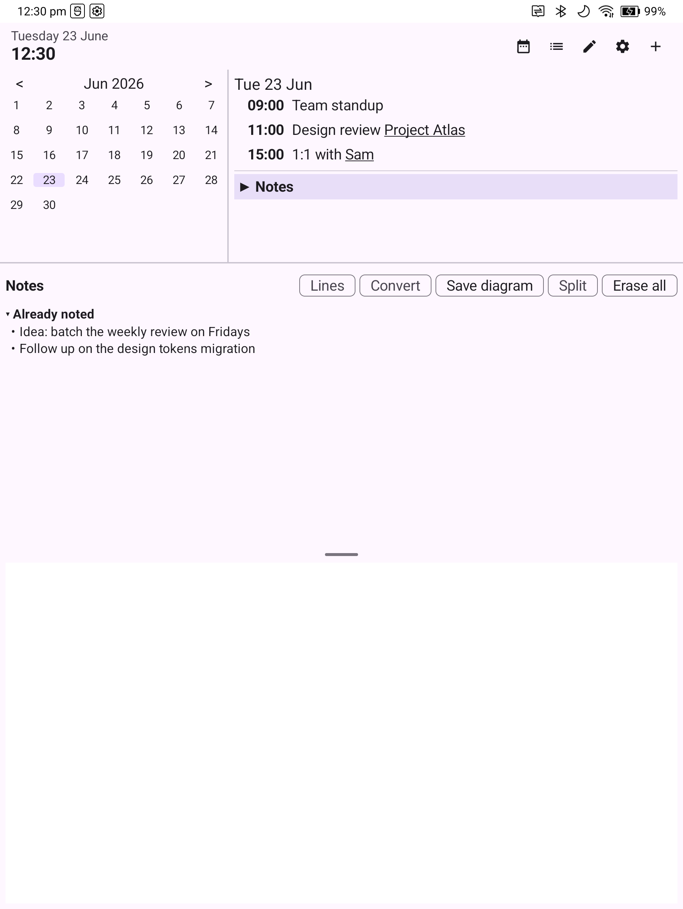
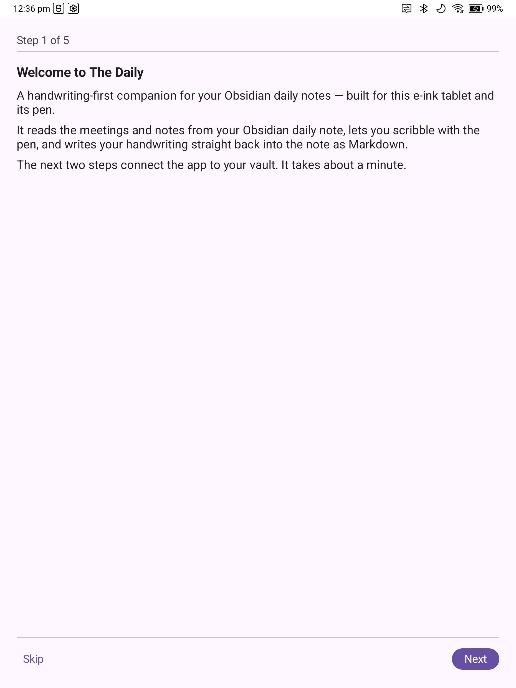
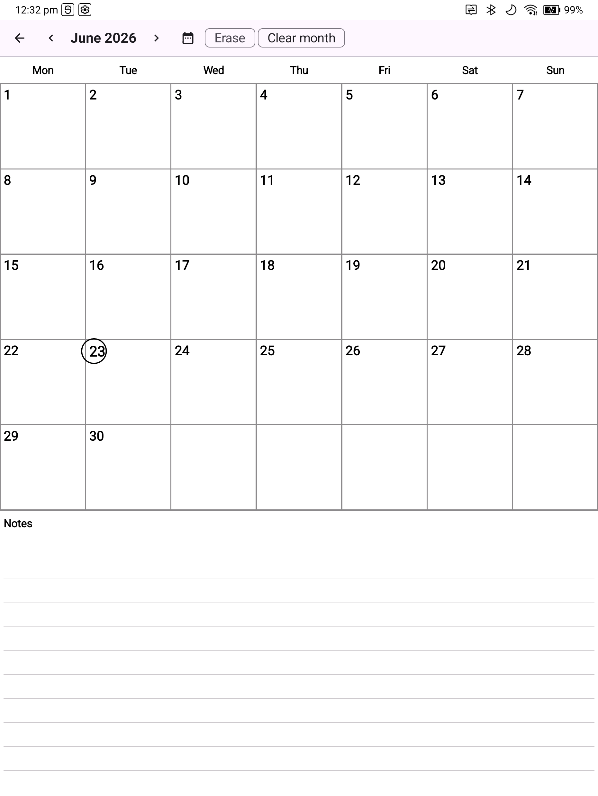
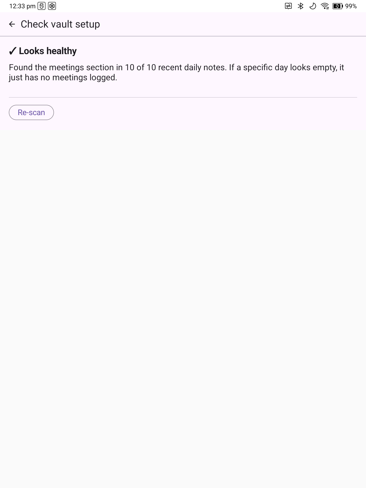

# The Daily

A Kotlin/Jetpack Compose Android app for **Boox e-ink tablets** that turns your Obsidian daily note into a handwriting-first agenda. See your day's meetings, scribble with the pen at hardware latency, convert handwriting into Markdown bullets, and have them written straight back into your daily-note file on-device — plus a standalone scribble wall-planner and an at-a-glance home-screen widget.

> **Target device:** Boox U7 / Go 10.3 and compatible Onyx Boox hardware running Android 10+ (`minSdk 29`). None of the e-ink/pen behaviour reproduces in an emulator.

## Screenshots

| Day agenda + handwriting canvas | First-run onboarding |
|---|---|
|  |  |

| Scribble wall-planner | Vault health check |
|---|---|
|  |  |

*(Screenshots use a throwaway sample vault — no personal data.)*

## What it does

- **Merged day view** — your Obsidian daily-note meetings rendered as a day agenda beside a month grid. Tap a day to open it; tap the header to jump to today. (A read-only Google Calendar overlay is scaffolded but currently deferred.)
- **Low-latency ink** — a handwriting surface driven by the Onyx Pen SDK raw-drawing mode, so the e-ink controller paints strokes at hardware latency rather than through Compose recomposition. Hardware (side-button) and on-screen erasing both supported.
- **Handwriting → Markdown** — manual `Convert` turns ink into Markdown bullets via Onyx's built-in MyScript recogniser (an alternative on-device ML Kit engine is selectable in Settings). Bullets are written into the daily note under the right meeting or the Notes section.
- **Handwriting → diagram** — `Save diagram` rasterises your strokes to a PNG under `attachments/Diagrams/<year>/W<week>/` and inserts an Obsidian `![[…]]` embed.
- **Writes back to your vault safely** — every write uses an atomic write-then-replace (`.tmp` sibling + rename) so a concurrently running Obsidian LiveSync never sees a partial file.
- **Vault Notes** — pick *any* `.md` file in the vault (folder tree or filename search) and handwrite bullets — or save a diagram — spliced in at the line you tap.
- **Scribble calendar** — a month grid you write over freely like a paper wall-planner, saved on-device (not in Obsidian), page through any month.
- **Quick add** — add meetings and notes by text without picking up the pen.
- **First-run onboarding** — a guided tour: grant file access → point at your vault → feature highlights. Re-openable any time from Settings.
- **Vault health diagnostics** — if no meetings can be read, a Calendar banner offers to diagnose it. *Check vault setup* scans your recent notes and recommends fixes with one tap: the heading where your meeting times actually live, or a corrected daily-note folder template detected from a found note.
- **Configurable to your vault** — set which headings hold meetings vs notes (matched forgivingly — `#` level, spacing and case are ignored) and the Periodic Notes folder template.
- **Home-screen agenda widget** — the day's meetings on your launcher, refreshed after in-app edits.
- **Built for e-ink** — scaled-up type, thick/dark affordances, large touch targets, no animation, single light theme.

## Privacy

The app makes **no cloud or AI calls** — handwriting recognition runs on-device. It declares no `INTERNET` permission. File access is local only, via `MANAGE_EXTERNAL_STORAGE` against the vault folder you choose. (The optional ML Kit engine downloads its language model once; the default Onyx engine is fully offline.)

## Install

### Option A — sideload a prebuilt APK (easiest for sharing)

1. Build the debug APK (see [Build from source](#option-b--build-from-source)) — it lands at `app/build/outputs/apk/debug/app-debug.apk`.
2. Get it onto the tablet, either:
   - **Over USB:** `adb install -r app/build/outputs/apk/debug/app-debug.apk`, or
   - **Manually:** copy the `.apk` to the device (USB, cloud, BooxDrop) and tap it in the file manager. Allow "install unknown apps" if prompted.
3. Launch **The Daily**. The onboarding tour will walk you through the two required steps:
   - **Grant all-files access** — toggle *Allow access to manage all files* on the settings page it opens, then return.
   - **Point to your vault** — *Browse* to your Obsidian vault's top folder (or type the path) and Save.
4. If your daily notes don't use the default `👥 Meetings` / `📝 Notes` headings or the default folder layout, open **Settings → Check vault setup** — it will detect and offer to apply the right values.

### Option B — build from source

```bash
git clone https://github.com/mbulling83/obsidian-calendar-memo.git
cd obsidian-calendar-memo

# Build a debug APK
./gradlew assembleDebug

# …or build and install straight to a connected device
./gradlew installDebug
```

Requirements: JDK 17, Android SDK (compileSdk 35). The Onyx SDK (`onyxsdk-device` / `-pen` / `-base`) is published only on Boox's own Maven repo (`repo.boox.com`), already wired into `settings.gradle.kts`. There are no API keys or secrets to configure.

## Daily note format

The parsers and writers expect this section structure (headings and folder layout are configurable — these are the defaults):

```markdown
# 👥 Meetings
- 09:00 - 10:00: Standup
	- some detail bullet
- 10:30 - 11:00: 1:1 with [[Person]]

# 📝 Notes
- a note bullet
```

- **Meetings** live under `# 👥 Meetings` as `- HH:MM - HH:MM: Title` lines, optionally followed by indented `\t- bullet` detail lines. New meetings are inserted in chronological order.
- **Notes** live under `# 📝 Notes` as `- bullet` lines.
- Section parsing is bounded to the target section (heading → next heading / `---`), so Dataview/DataviewJS blocks elsewhere are never touched.
- The default daily-note path follows the Periodic Notes convention `Periodic Notes/Daily Notes/{year}/{monthFolder}/{isoDate}.md` (`VaultSettings.DEFAULT_TEMPLATE`); the `{year}`/`{monthFolder}`/`{isoDate}` template is editable in Settings.

## Architecture

See [`CLAUDE.md`](CLAUDE.md) for the full package map and key decisions. In brief:

| Package | Responsibility |
|---|---|
| `calendar/` | Month grid + day view; `DayViewModel` owns the merged day state |
| `vault/` | All file I/O (`DailyNoteRepository`, `VaultFileRepository`, `DiagramRepository`), section parsers, `SectionHeading` (forgiving matching), `VaultDiagnostics`/`VaultScanner` (health checks), `VaultSettings` |
| `memo/` | `OnyxInkSurfaceView` (raw pen), `MemoCanvas`, `StrokeStore`, conversion + diagram actions |
| `vaultnotes/` | Handwrite into any vault `.md` file |
| `scribble/` | Standalone month scribble wall-planner (on-device ink) |
| `hwr/` | `OnyxHWREngine` (firmware MyScript via AIDL), `MlKitHWREngine`, `BulletFormatter` |
| `onboarding/` · `vaultcheck/` | First-run tour · diagnostics screen + Calendar banner |
| `settings/` · `quickadd/` · `widget/` · `gcal/` · `ui/` | Settings/DataStore · text quick-add · home-screen widget · deferred GCal · shared UI |

Key decisions: vault access uses `MANAGE_EXTERNAL_STORAGE` + direct `java.io.File` (not SAF), matching the confirmed-working Onyx pattern; `DailyNoteRepository` is the single owner of daily-note I/O with write-then-replace; the Onyx HWR binding speaks a hand-rolled protobuf to the undocumented `KHwrService`.

## Build & test

```bash
./gradlew assembleDebug                 # debug APK
./gradlew installDebug                  # install to device
./gradlew test                          # JVM unit tests (no emulator)
./gradlew test --tests "com.boxmemo.app.vault.*"   # one package
```

JVM unit tests (no Android runtime) cover the parsers, formatters, `StrokeStore`, `EraseHitTest`, `DailyNoteRepository`, `DiagramPaths`, `MonthScribbleStore`, `SectionHeading`, and `VaultDiagnostics`. Device-only glue (pen, EPD, firmware HWR, bitmap render, filesystem walk) is exercised manually on hardware. `org.json:json` is on the test classpath so `JSONObject` works on the JVM.

## Tech stack

Kotlin · Jetpack Compose (Material 3) · AndroidX Lifecycle / DataStore · Jetpack Ink · Onyx Boox SDK (device/pen/base) · ML Kit digital-ink recognition · firmware MyScript (AIDL). No network, no cloud services.
