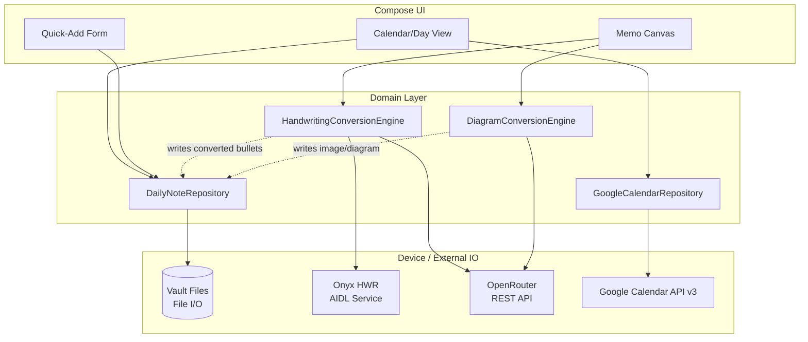

# Boox Obsidian Calendar Memo

## Summary

A new Kotlin/Jetpack Compose Android app for Boox e-ink tablets, built from scratch but following Aragonite's proven patterns (Onyx HWR AIDL binding, direct `File`-based vault access, Jetpack Ink stroke rendering). The app reads/writes the user's Obsidian daily note directly on-device, renders a Boox-style month/day calendar merged with a read-only Google Calendar overlay, and provides a handwriting memo surface per day with manually-triggered conversion: handwriting → Markdown bullets (Onyx HWR or OpenRouter vision OCR, user's choice) and diagrams → image or HTML/diagram code (also user's choice), both written back into the daily note in the user's existing format.

---

## Problem Frame

(see origin: docs/brainstorms/boox-obsidian-calendar-memo-requirements.md — Problem Frame)

---

## Requirements

- R1. Month/day calendar view modeled on the native Boox Calendar+Memo layout.
- R2. Day view lists meetings parsed from the day's Obsidian daily note `# 👥 Meetings` section in the `HH:MM - HH:MM: Title` format.
- R3. Day view shows that day's Google Calendar events (user-configured subset of calendars — work, personal, family, school), read-only, visually distinguished from Obsidian-sourced meetings.
- R4. Google Calendar events are never written back to Google Calendar or to the Obsidian note.
- R5. User can add a new meeting/note entry via a quick form (time + title), not handwriting.
- R6. New entries are appended to `# 👥 Meetings` or `# 📝 Notes` in the same format as existing entries.
- R7. User can write by hand in a memo pane scoped to a date and, where applicable, a specific meeting/note entry.
- R8. Handwriting-to-text conversion is manually triggered per capture, never automatic.
- R9. Per conversion, user chooses Onyx built-in handwriting recognition or AI vision OCR (OpenRouter); the app remembers the last-used method as the default, with an easy per-capture override.
- R10. Converted text is formatted as nested bullets matching the existing meeting-note structure (top-level line + indented detail bullets) before being written into the daily note.
- R11. User can draw diagrams by hand in the same memo pane.
- R12. Diagram conversion is manually triggered per diagram, with the user choosing image recreation or HTML/diagram-code recreation each time.
- R13. The chosen AI model (via OpenRouter) recreates the diagram in the selected format and the result is inserted into the daily note.
- R14. The app reads/writes daily note files from local on-device storage; it does not implement its own CouchDB/LiveSync client.
- R15. The app operates on one daily note per calendar day, matching the Periodic Notes daily-note path convention.

**Origin acceptance examples:** AE1 (covers R8, R9, R10), AE2 (covers R12, R13), AE3 (covers R3, R4), AE4 (covers R5, R6)

---

## Scope Boundaries

### Deferred for later

- Displaying or editing TaskNotes tasks in the calendar or day view.
- Batch/automatic conversion of handwriting or diagrams — v1 is manual, per-capture only.
- Two-way Google Calendar sync.

### Outside this product's identity

- General-purpose note-taking, file browsing, or notebook/folder organization on the device.
- Implementing a custom CouchDB/LiveSync sync engine inside the app.

### Deferred to Follow-Up Work

- Packaging/distribution (Play Store listing, F-Droid, signed release pipeline) — v1 targets debug-signed sideload via `adb install`, matching Aragonite's own setup workflow.
- Offline queueing of AI requests when the tablet has no network — v1 assumes AI conversion happens with connectivity present (handwriting capture itself works fully offline since it's local strokes).

---

## Context & Research

### Relevant Code and Patterns

No prior code exists in this repo (`obsidian-calendar-memo/` is currently empty). The primary architectural reference is the external [jdkruzr/aragonite](https://github.com/jdkruzr/aragonite) project (a fork of Notable for Onyx Boox devices, MIT licensed), confirmed by direct inspection of its source on 2026-06-18:

- **Onyx HWR (MyScript) AIDL binding** — `app/src/main/java/com/ethran/notable/io/OnyxHWREngine.kt`. Binds to `ComponentName("com.onyx.android.ksync", "com.onyx.android.ksync.service.KHwrService")` via `bindService`, waits on a `CountDownLatch`, then calls `IHWRService.init(HWRInputArgs, ...)` with `recognizerType = "MS_ON_SCREEN"` and a callback (`HWROutputCallback`) to confirm `recognizerActivated`. This is the only viable path to the device's built-in MyScript engine — there is no public SDK; it's a bound service exposed by Onyx's firmware (`com.onyx.android.ksync` package), discovered via the AIDL stub classes Aragonite vendors at `app/src/main/java/com/onyx/android/sdk/hwr/service/`.
- **Direct vault file access, not SAF** — `app/src/main/AndroidManifest.xml` requests `MANAGE_EXTERNAL_STORAGE`, `READ_EXTERNAL_STORAGE`, `WRITE_EXTERNAL_STORAGE`, and sets `android:requestLegacyExternalStorage="true"`. Combined with a plain `java.io.File`-based `obsidianInboxPath` setting (read in `InboxSyncEngine.kt`), this confirms the working pattern on Boox/Onyx hardware is a configured absolute filesystem path plus the all-files-access permission, not Storage Access Framework document trees. This resolves the planning-time question about vault file access.
- **Markdown generation and file write ordering** — `InboxSyncEngine.kt`: renders any page artifacts (image, container) first, then writes the markdown file last "since its presence signals sync completion to Obsidian file watchers" — i.e., LiveSync/file-watcher-based syncing assumes the markdown write is the final, atomic-looking step. This ordering principle should carry into our daily-note rewrite logic (write to a temp file, then rename/replace, so a LiveSync watcher never sees a half-written file).
- **Stroke rendering** — `androidx.ink` (`ink-nativeloader`, `ink-brush`, `ink-geometry`, `ink-rendering`, `ink-strokes`, version 1.0.0) replaces hand-rolled stroke rendering in upstream Notable. Confirmed in `app/build.gradle`.
- **Stack baseline** — Kotlin + Jetpack Compose, Hilt for DI, Room for local persistence, Coil for image loading, `kotlinx-serialization-json`, KSP (not just `kapt`), `minSdk 29`, `compileSdk 36`, JVM target 17. Confirmed in `app/build.gradle`.

These are used as **architectural reference only** — no Aragonite code or dependencies are copied or forked; this plan specifies a from-scratch implementation that mirrors the proven approach for the two hardest problems (HWR access, vault file access) and otherwise implements only what's needed for the calendar/memo/AI-conversion scope above (no Room notebook schema, no xopp/PDF import, no annotation-box wikilink UI).

### Institutional Learnings

None found — first project in this directory/workspace area.

### External References

- [jdkruzr/aragonite](https://github.com/jdkruzr/aragonite) — architectural reference for Onyx HWR binding and vault file access (see Relevant Code and Patterns above).
- OpenRouter (`https://openrouter.ai`) — OpenAI-compatible `chat/completions` REST endpoint; vision-capable models accept image content parts (base64 or URL) in the same request shape as OpenAI's API. Exact model identifiers and any vision/image-generation-specific parameters should be re-verified against current OpenRouter docs at implementation time (see Open Questions).
- Google Calendar API v3 — standard OAuth 2.0 + REST `events.list` per calendar ID; Android-side OAuth flow (Credential Manager / AppAuth) needs implementation-time research since this app authenticates a human Google account rather than a service account.

---

## Key Technical Decisions

- **Build fresh, not a fork**: keeps the app scoped exactly to calendar + manual conversion behavior, avoiding the maintenance burden of tracking an upstream notebook/PDF/xopp feature set this product doesn't need (see origin: Key Decisions).
- **Direct `File` I/O against a user-configured vault path**, gated behind `MANAGE_EXTERNAL_STORAGE`, matching Aragonite's confirmed-working pattern — avoids implementing a CouchDB/LiveSync client and avoids SAF's per-document-tree friction for a path that needs broad read/write across the vault's daily-notes folder.
- **Write-then-replace for the daily note file**: write to a sibling temp file and rename over the original, never edit in place, so a concurrently-running LiveSync watcher on the same device never observes a partially-written note. This is an inference from Aragonite's "write markdown last" ordering principle, generalized to our read-modify-write case (Aragonite only ever appends a new file; we mutate an existing one).
- **Markdown parsing via a dedicated section-aware parser, not regex-only line scraping**: the daily note has multiple `#`-headed sections (`📝 Notes`, `👥 Meetings`, `Memos`, plus the Dataview/DataviewJS blocks). The parser must locate the `# 👥 Meetings` heading specifically and operate only within that section's line range, so the Dataview code blocks elsewhere in the file are never touched.
- **OpenRouter as a thin REST client, not a vendor SDK**: both vision OCR and diagram generation go through the same OpenAI-compatible endpoint shape, so one small client suffices for both features (R9, R13), keeping the AI integration surface minimal.

---

## Open Questions

### Resolved During Planning

- Vault file access mechanism: direct `File` I/O under `MANAGE_EXTERNAL_STORAGE`, confirmed via Aragonite's manifest and settings pattern (see Context & Research).
- Onyx HWR integration path: bind to the `com.onyx.android.ksync` AIDL service, confirmed via Aragonite's `OnyxHWREngine.kt`.

### Deferred to Implementation

- Exact OpenRouter model identifiers for vision OCR and for image-generation vs. HTML/diagram-code generation — current docs should be checked at implementation time since model availability/naming on OpenRouter changes over time.
- Google Calendar Android OAuth flow specifics (Credential Manager vs. AppAuth vs. Google Sign-In SDK) — needs implementation-time research; the existing `google-calendar-importer` Obsidian plugin's OAuth client (visible in the vault's plugin data) may be reusable as a reference but is a desktop-OAuth flow, not directly portable to Android.
- Exact daily-note path resolution (e.g., `Periodic Notes/Daily Notes/YYYY/MM - Month/YYYY-MM-DD.md`) should be configurable rather than hardcoded, since the user's Periodic Notes folder structure could change; defer the exact settings UI shape to implementation.
- Whether the `# 📝 Notes` section needs the same per-entry scoping as `# 👥 Meetings` (R10 implies meeting-level granularity; Notes entries aren't individually timestamped) — implementer should treat Notes captures as page-level (append-only bullets under the heading) unless this surfaces as a problem during implementation.
- Behavior when the daily note file does not yet exist for a selected date (e.g., a future date with no note created yet) — implementer should decide between read-only "no note yet" state vs. creating an empty note from the Templater template; flagged because the template uses Templater syntax (`<% tp.file.cursor() %>`) the app should not attempt to execute.

---

## High-Level Technical Design

> This illustrates the intended approach and is directional guidance for review, not implementation specification. The implementing agent should treat it as context, not code to reproduce.



`DailyNoteRepository` is the single owner of reading and writing the day's note file — both the calendar view and both conversion engines go through it rather than touching the filesystem directly, so the write-then-replace discipline and section-aware parsing live in one place.

---

## Output Structure

    app/src/main/java/com/<pkg>/boxmemo/
      calendar/
        CalendarView.kt           # month grid
        DayView.kt                # day's event list + memo pane host
        DayViewModel.kt
      vault/
        DailyNoteRepository.kt    # read/write daily note file
        MeetingSectionParser.kt   # parses/writes "# 👥 Meetings" section
        NotesSectionParser.kt     # parses/writes "# 📝 Notes" section
        VaultSettings.kt          # configured vault path, daily-note path template
      gcal/
        GoogleCalendarRepository.kt
        GoogleAuthManager.kt
      memo/
        MemoCanvas.kt             # Jetpack Ink-based drawing surface
        CaptureScope.kt           # binds a capture to a date/meeting entry
      hwr/
        OnyxHWREngine.kt          # AIDL binding, mirrors Aragonite's approach
        VisionOcrClient.kt        # OpenRouter vision OCR
        BulletFormatter.kt        # recognized text -> nested bullet markdown
      diagram/
        DiagramConversionClient.kt # OpenRouter image/diagram generation
      quickadd/
        QuickAddForm.kt
      settings/
        SettingsScreen.kt

---

## Implementation Units

### U1. Project scaffolding and vault settings

**Goal:** Stand up the Android project (Kotlin/Compose/Hilt) and a settings screen where the user configures the vault root path and confirms the `MANAGE_EXTERNAL_STORAGE` permission, mirroring Aragonite's confirmed-working access pattern.

**Requirements:** R14, R15

**Dependencies:** None

**Files:**
- Create: `app/build.gradle`, `app/src/main/AndroidManifest.xml`
- Create: `app/src/main/java/com/<pkg>/boxmemo/settings/SettingsScreen.kt`
- Create: `app/src/main/java/com/<pkg>/boxmemo/vault/VaultSettings.kt`
- Test: `app/src/test/java/com/<pkg>/boxmemo/vault/VaultSettingsTest.kt`

**Approach:**
- Request `MANAGE_EXTERNAL_STORAGE` (with the system "all files access" settings-redirect flow Android requires for this permission), plus `READ_EXTERNAL_STORAGE`/`WRITE_EXTERNAL_STORAGE` for pre-30 compatibility, matching Aragonite's manifest.
- `VaultSettings` stores the absolute vault root path and a daily-note path template (default matching the user's confirmed `Periodic Notes/Daily Notes/YYYY/MM - Month/YYYY-MM-DD.md` structure) so it's adjustable without a rebuild.

**Patterns to follow:**
- Aragonite's `AndroidManifest.xml` permission block and `requestLegacyExternalStorage` flag.

**Test scenarios:**
- Happy path: given a vault root and today's date, `VaultSettings` resolves the expected absolute daily-note file path.
- Edge case: date crossing a month/year boundary (e.g., Dec 31 → Jan 1) resolves into the correct year/month subfolder.
- Error path: vault root not yet configured returns a clear "not configured" state rather than throwing.

**Verification:**
- App builds and installs; settings screen persists a vault path across app restarts; permission flow completes on a real or emulated device running API 29+.

---

### U2. Daily note read and meeting-section parsing

**Goal:** Read the day's note file and parse the `# 👥 Meetings` section into a structured list of timed entries, without touching any other section (Dataview blocks, Notes, Memos).

**Requirements:** R2, R15

**Dependencies:** U1

**Execution note:** Test-first for the parser — this is pure, deterministic text-transformation logic with high format-fidelity stakes (corrupting a real daily note is costly), so writing the test scenarios below before the parser implementation is the right posture.

**Files:**
- Create: `app/src/main/java/com/<pkg>/boxmemo/vault/DailyNoteRepository.kt`
- Create: `app/src/main/java/com/<pkg>/boxmemo/vault/MeetingSectionParser.kt`
- Test: `app/src/test/java/com/<pkg>/boxmemo/vault/MeetingSectionParserTest.kt`

**Approach:**
- Locate the line containing `# 👥 Meetings`, then the next top-level `#`-heading or `---` rule as the section's end boundary.
- Within that range, parse lines matching `HH:MM - HH:MM: Title` (with optional trailing `[[wiki links]]`) as meeting entries, and subsequent more-indented lines as that meeting's detail bullets, until the next timed-entry line or section end.
- Use real captured daily notes (e.g., the `2026-06-17.md` 1:1 example with nested bullets under `[[Ioana Havsfrid]]`) as the model for expected parser output during test-writing — do not invent a simplified format.

**Test scenarios:**
- Happy path: a meeting line followed by 2-3 indented detail bullets parses into one entry with title, time range, and bullet list.
- Happy path: multiple meetings in one section parse into multiple distinct entries, each capturing only its own bullets.
- Edge case: empty `# 👥 Meetings` section (just the heading, no entries) parses to an empty list, not an error.
- Edge case: a meeting line with a `[[wiki link]]` in the title parses the link text correctly without breaking on the brackets.
- Error path: a daily note missing the `# 👥 Meetings` heading entirely returns an explicit "section not found" result rather than throwing or silently returning an empty list (callers need to distinguish "no meetings" from "malformed note").
- Integration: parsing does not mutate or include any content from the `# 📝 Notes`, `# Memos`, or Dataview code-block sections of the same file.

**Verification:**
- Parsing the user's real `2026-06-17.md` (or an equivalent fixture copied from it) reproduces the 1:1 meeting entry with all nested bullets intact.

---

### U3. Google Calendar read-only integration

**Goal:** Authenticate against the user's Google account and fetch events for a user-selected subset of calendars (work, personal, family, school) for a given day, read-only.

**Requirements:** R3, R4

**Dependencies:** U1

**Files:**
- Create: `app/src/main/java/com/<pkg>/boxmemo/gcal/GoogleAuthManager.kt`
- Create: `app/src/main/java/com/<pkg>/boxmemo/gcal/GoogleCalendarRepository.kt`
- Create: `app/src/main/java/com/<pkg>/boxmemo/settings/CalendarSelectionScreen.kt`
- Test: `app/src/test/java/com/<pkg>/boxmemo/gcal/GoogleCalendarRepositoryTest.kt`

**Approach:**
- OAuth flow research is deferred to implementation (see Open Questions); whichever mechanism is chosen, it must request only read-only Calendar scope (`calendar.readonly` or `calendar.events.readonly`), never the read-write scope, enforcing R4 at the permission level rather than only in app logic.
- `GoogleCalendarRepository` exposes a single method to fetch events for a given date across the user-selected calendar IDs, returning a normalized event model (title, start, end, all-day flag, source calendar).
- Calendar selection (work/personal/family/school) is a settings-time choice, not hardcoded.

**Test scenarios:**
- Happy path: fetching events for a date with both timed and all-day events returns both, normalized to the same event model.
- Edge case: a day with zero events across all selected calendars returns an empty list, not an error.
- Error path: expired/revoked OAuth token surfaces a re-authentication prompt rather than crashing or silently showing no events.
- Integration: events from multiple selected calendars (e.g., work + family) are merged into one chronological list with each event still tagged by its source calendar.

**Verification:**
- A real Google account with events on multiple selected calendars shows all of them, correctly time-ordered, with no write-scope permission ever requested.

---

### U4. Calendar UI: month grid, merged day view

**Goal:** Render the Boox-style month/day calendar UI, merging Obsidian meetings (U2) and Google Calendar events (U3) into one visually-distinguished day list.

**Requirements:** R1, R3

**Dependencies:** U2, U3

**Files:**
- Create: `app/src/main/java/com/<pkg>/boxmemo/calendar/CalendarView.kt`
- Create: `app/src/main/java/com/<pkg>/boxmemo/calendar/DayView.kt`
- Create: `app/src/main/java/com/<pkg>/boxmemo/calendar/DayViewModel.kt`
- Test: `app/src/test/java/com/<pkg>/boxmemo/calendar/DayViewModelTest.kt`

**Approach:**
- Month grid mirrors the reference screenshot's layout (month nav arrows, day cells, today/selected highlighting); day panel lists merged events above the memo canvas placeholder (wired in U6).
- Visual distinction between Obsidian-sourced and Google-Calendar-sourced entries (e.g., distinct leading icon or label) satisfies R3's "visually distinguished" requirement; exact styling is an implementation-time UI decision, not a planning-time one.

**Technical design:** *(optional — directional only)* `DayViewModel` exposes a single merged, time-sorted list of a small sealed type (`ObsidianMeeting` / `GoogleEvent`) rather than two parallel lists, so the Compose list renderer doesn't need to interleave-sort in the UI layer.

**Test scenarios:**
- Happy path: given one Obsidian meeting and one Google event at different times, the merged list renders both in chronological order.
- Edge case: an Obsidian meeting and a Google event with identical start times both appear, in a stable (e.g., source-then-title) tiebreak order.
- Integration: selecting a different day re-fetches both sources and re-renders without stale data from the previously-selected day.

**Verification:**
- Navigating the month grid and selecting days shows the correct merged event list per day, matching what's in the actual daily note and Google Calendar for that date.

---

### U5. Quick-add form for new meetings and notes

**Goal:** Let the user add a new meeting (time + title) or note entry via a form, writing it into the daily note in the existing format.

**Requirements:** R5, R6

**Dependencies:** U2, U4

**Files:**
- Create: `app/src/main/java/com/<pkg>/boxmemo/quickadd/QuickAddForm.kt`
- Modify: `app/src/main/java/com/<pkg>/boxmemo/vault/MeetingSectionParser.kt` (add a writer counterpart)
- Create: `app/src/main/java/com/<pkg>/boxmemo/vault/NotesSectionParser.kt`
- Test: `app/src/test/java/com/<pkg>/boxmemo/vault/MeetingSectionWriterTest.kt`

**Approach:**
- Writing a new meeting line inserts it in chronological order within the existing `# 👥 Meetings` section (not just appended at the end), so a daily note edited partly in-app and partly in Obsidian stays readable.
- Use the write-then-replace-file discipline from Key Technical Decisions for every write in this unit.
- Note entries append as a plain bullet under `# 📝 Notes` (no time component, since the existing format for that section is untimed, per the `2026-06-18.md` example).

**Test scenarios:**
- Happy path: adding a meeting to a day with existing meetings inserts it at the chronologically correct position, leaving other entries untouched.
- Happy path: adding a meeting to an empty `# 👥 Meetings` section produces a single correctly-formatted line.
- Edge case: adding a meeting whose time exactly matches an existing entry's time inserts it adjacent without merging or overwriting the existing entry.
- Error path: write failure (e.g., disk full, permission revoked mid-session) leaves the original file untouched (write-then-replace must not partially overwrite).
- Covers AE4. Given an empty day, adding a meeting via the form produces a `HH:MM - HH:MM: Title` line identical in format to one typed directly in Obsidian.

**Verification:**
- A meeting added in-app, when the note is later opened in Obsidian, renders identically to a hand-typed entry — no formatting artifacts, no disturbed surrounding sections.

---

### U6. Handwriting memo canvas

**Goal:** Provide a Jetpack Ink-based drawing surface scoped to a date and, where applicable, a specific meeting/note entry, supporting both text and diagram capture.

**Requirements:** R7, R11

**Dependencies:** U4

**Files:**
- Create: `app/src/main/java/com/<pkg>/boxmemo/memo/MemoCanvas.kt`
- Create: `app/src/main/java/com/<pkg>/boxmemo/memo/CaptureScope.kt`
- Test: `app/src/androidTest/java/com/<pkg>/boxmemo/memo/MemoCanvasTest.kt`

**Approach:**
- Use `androidx.ink` (`ink-brush`, `ink-geometry`, `ink-rendering`, `ink-strokes`) for stroke capture and rendering, matching Aragonite's confirmed approach for e-ink-friendly rendering.
- `CaptureScope` is the binding between a set of strokes and a target location in the daily note (a specific meeting entry, the Notes section, or "unscoped" for a fresh capture) — both conversion engines (U7-U10) consume a `CaptureScope` plus its strokes, not raw canvas state.

**Test scenarios:**
- Happy path: strokes drawn in the canvas persist and re-render correctly after navigating away and back to the same day/entry.
- Edge case: switching `CaptureScope` (e.g., from one meeting to another) does not bleed strokes from one scope into another.
- Test expectation: detailed e-ink refresh/latency tuning is a device-specific concern validated manually on hardware, not a unit-testable scenario — covered by manual verification below instead.

**Verification:**
- On a physical Boox device, writing feels responsive (no visible lag) and strokes render correctly across app navigation and scope switches.

---

### U7. Onyx HWR integration (built-in recognition path)

**Goal:** Recognize handwritten strokes into plain text using the device's built-in MyScript engine via the same AIDL binding Aragonite uses, triggered manually per capture.

**Requirements:** R8, R9

**Dependencies:** U6

**Files:**
- Create: `app/src/main/java/com/<pkg>/boxmemo/hwr/OnyxHWREngine.kt`
- Create: `app/src/main/java/com/<pkg>/boxmemo/hwr/service/` (vendored AIDL stub classes, mirroring Aragonite's `com/onyx/android/sdk/hwr/service/` package)
- Test: `app/src/test/java/com/<pkg>/boxmemo/hwr/OnyxHWREngineTest.kt`

**Approach:**
- Bind to `ComponentName("com.onyx.android.ksync", "com.onyx.android.ksync.service.KHwrService")`, mirroring `OnyxHWREngine.kt`'s `bindAndAwait`/`ensureInitialized` pattern, including its timeout and `CountDownLatch`-based connection wait.
- Recognition is triggered only by an explicit user action (a "convert" button on the active capture), never on save or navigation, satisfying R8.

**Test scenarios:**
- Happy path: a successful service bind and `init` call with `recognizerActivated = true` allows recognition to proceed.
- Error path: service bind failure (e.g., running on non-Onyx hardware or the service unavailable) surfaces a clear "built-in recognition unavailable" state rather than crashing, and should prompt the user toward the AI vision OCR alternative (U8).
- Error path: bind timeout (service never connects within the timeout window) is treated the same as bind failure.
- Test expectation: actual recognition accuracy against the real MyScript engine cannot be unit-tested (it depends on Onyx firmware) — covered by manual verification on hardware instead.

**Verification:**
- On a physical Boox device, triggering conversion on a real handwritten capture returns recognized text via the bound service.

---

### U8. AI vision OCR via OpenRouter (alternative recognition path)

**Goal:** Recognize handwritten strokes into plain text using an AI vision model via OpenRouter, as the user-selectable alternative to U7, with the last-used method remembered as default.

**Requirements:** R9

**Dependencies:** U6

**Files:**
- Create: `app/src/main/java/com/<pkg>/boxmemo/hwr/VisionOcrClient.kt`
- Create: `app/src/main/java/com/<pkg>/boxmemo/hwr/RecognitionMethodPreference.kt`
- Test: `app/src/test/java/com/<pkg>/boxmemo/hwr/VisionOcrClientTest.kt`

**Approach:**
- Render the capture's strokes to a bitmap (reusing whatever bitmap-export path U6's canvas already needs for any preview thumbnail) and send it as an image content part in an OpenRouter `chat/completions` request to a vision-capable model, with a prompt instructing plain-text transcription only.
- `RecognitionMethodPreference` persists the last-chosen method (Onyx vs. AI vision) and is read by the capture UI to pre-select the default, satisfying the "remembered as default, easy override" requirement from R9.

**Test scenarios:**
- Happy path: a successful OpenRouter response with transcribed text is returned to the caller in the same shape U7 returns (so downstream formatting in U9 doesn't need to know which engine produced it).
- Error path: network failure or non-2xx response surfaces a clear "AI OCR failed" state without writing anything into the note.
- Error path: malformed/empty response from the model (e.g., the model returns a refusal or empty string) is treated as a failure, not as valid empty recognized text.
- Edge case: switching the remembered default from Onyx to AI vision (or back) persists across app restarts.

**Verification:**
- Triggering AI vision OCR on a real handwritten capture, with a valid OpenRouter API key configured, returns transcribed text.

---

### U9. Bullet formatting and write-back of recognized text

**Goal:** Format recognized text (from either U7 or U8) as nested bullets matching the existing meeting-note structure, and write it into the daily note under the correct meeting/note entry.

**Requirements:** R10

**Dependencies:** U7, U8, U2, U5

**Execution note:** Test-first — formatting fidelity to the user's existing structure is the core value proposition of this feature; getting the bullet shape wrong undermines R10 even if recognition itself succeeds.

**Files:**
- Create: `app/src/main/java/com/<pkg>/boxmemo/hwr/BulletFormatter.kt`
- Modify: `app/src/main/java/com/<pkg>/boxmemo/vault/MeetingSectionParser.kt` (insert formatted bullets under a specific entry)
- Test: `app/src/test/java/com/<pkg>/boxmemo/hwr/BulletFormatterTest.kt`

**Approach:**
- `BulletFormatter` takes recognized plain text (which may contain the model's own line breaks or punctuation-implied sentence breaks) and produces an indented bullet list matching the depth/style of existing entries (e.g., the `2026-06-17.md` 1:1 example's single-level indent under the meeting line).
- Insertion target is the `CaptureScope` from U6 — a specific meeting entry, or the page-level `# 📝 Notes` section for unscoped/Notes captures.

**Test scenarios:**
- Covers AE1. Given recognized text for a capture scoped to an existing meeting, conversion appends indented bullets directly under that meeting's existing line, leaving its prior bullets and all other meetings untouched.
- Happy path: recognized text with multiple sentences splits into multiple bullets at sentence boundaries.
- Edge case: recognized text that's a single short phrase produces exactly one bullet, not an empty or malformed list.
- Edge case: a capture scoped to the `# 📝 Notes` section appends a plain (non-meeting-nested) bullet under that heading instead.
- Error path: recognized text is empty (e.g., OCR returned nothing usable) — no write occurs, and the user sees a clear "nothing recognized" state rather than an empty bullet being silently inserted.

**Verification:**
- A real handwritten capture under a real meeting entry converts and writes bullets that, opened in Obsidian, are indistinguishable in style from bullets the user typed by hand under that same meeting.

---

### U10. Diagram capture and AI conversion

**Goal:** Let the user manually convert a hand-drawn diagram into either an AI-recreated image or HTML/diagram code, choosing per diagram, and insert the result into the daily note.

**Requirements:** R11, R12, R13

**Dependencies:** U6, U2, U5

**Files:**
- Create: `app/src/main/java/com/<pkg>/boxmemo/diagram/DiagramConversionClient.kt`
- Create: `app/src/main/java/com/<pkg>/boxmemo/diagram/DiagramOutputChoiceDialog.kt`
- Modify: `app/src/main/java/com/<pkg>/boxmemo/vault/DailyNoteRepository.kt` (image-file write + embed-link insertion; diagram-code block insertion)
- Test: `app/src/test/java/com/<pkg>/boxmemo/diagram/DiagramConversionClientTest.kt`

**Approach:**
- Render the diagram capture to a bitmap and send it to an OpenRouter model via the same client shape as U8, but with a prompt branching on the user's per-diagram choice: "recreate as a clean image" (image-generation-capable model) vs. "recreate as HTML/diagram code" (text-completion model instructed to output Mermaid or equivalent diagram markup).
- Image output: save the returned image into the vault's attachments folder convention and insert an embed link (`![[filename]]`) at the capture's scope location.
- Diagram-code output: insert the returned code as a fenced code block (e.g., ` ```mermaid `) at the capture's scope location, renderable by the user's existing `mermaid-tools` Obsidian plugin.

**Test scenarios:**
- Covers AE2. Given a hand-drawn flowchart, choosing "HTML diagram" produces diagram markup (not a raster image) inserted into the note; choosing "image" instead produces an image file with an embed link.
- Happy path: a successful image-generation response is saved to the attachments folder with a unique filename and embedded correctly.
- Happy path: a successful diagram-code response is wrapped in the correct fenced-code-block syntax for the target renderer.
- Error path: network failure or non-2xx response surfaces a clear "diagram conversion failed" state without writing anything into the note.
- Error path: image-generation response that isn't valid image data (e.g., the model returns text instead) is treated as a failure, not written as a corrupt file.

**Verification:**
- A real hand-drawn diagram, converted via each output choice, produces a note that — opened in Obsidian — shows either a correctly-embedded image or a correctly-rendered Mermaid diagram.

---

## System-Wide Impact

- **Interaction graph:** All daily-note mutations (U5, U9, U10) and all daily-note reads (U2, U4) funnel through `DailyNoteRepository`, so file-locking/ordering discipline only needs to be correct in one place.
- **Error propagation:** Recognition and AI-conversion failures (U7, U8, U10) must surface to the user as explicit failure states and must never partially write to the daily note — a failed conversion should leave the note exactly as it was before the attempt.
- **State lifecycle risks:** Concurrent access between this app and Obsidian mobile's LiveSync process on the same device is the primary risk — the write-then-replace discipline (Key Technical Decisions) mitigates partial-write visibility, but a LiveSync write landing mid-read on our side is also possible; the repository should tolerate a transient read failure (e.g., file briefly missing during a LiveSync replace) by retrying once rather than crashing.
- **API surface parity:** None — this is a single-surface mobile app with no other client to keep in parity.
- **Integration coverage:** The most important cross-layer scenario unit tests can't fully prove is U7/U8 → U9 → `DailyNoteRepository`: a real recognized-text result correctly landing as bullets under the correct meeting in a real file. Cover this with the manual verification steps in U7, U8, and U9 on a real device against a real (or realistic fixture) daily note.

---

## Risks & Dependencies

| Risk | Mitigation |
|------|------------|
| Onyx HWR AIDL service is undocumented and Boox-firmware-version-dependent; it may not bind on all Boox models/firmware versions | U8 (AI vision OCR) exists specifically as a fallback path; U7's error handling routes the user there on bind failure |
| OpenRouter model availability/pricing changes over time, and exact vision/image-gen model identifiers aren't fixed in this plan | Keep model identifiers in a config value, not hardcoded inline, so they can be updated without a structural code change |
| Concurrent file access between this app and Obsidian mobile's LiveSync on the same device could cause transient read/write conflicts | Write-then-replace discipline plus single-retry-on-read-failure (see System-Wide Impact) |
| `MANAGE_EXTERNAL_STORAGE` is a sensitive permission Google Play restricts for store distribution | Acceptable for now since this plan's distribution model is sideload (`adb install`), matching Aragonite's own setup instructions; flagged in Scope Boundaries as a follow-up concern if store distribution is ever pursued |
| Google Calendar OAuth on Android (token refresh, consent screen, scope verification for unverified apps) is unresearched at planning time | Captured explicitly under Open Questions → Deferred to Implementation; U3 should not proceed past a spike/prototype until this is resolved |

---

## Sources & References

- **Origin document:** [docs/brainstorms/boox-obsidian-calendar-memo-requirements.md](../brainstorms/boox-obsidian-calendar-memo-requirements.md)
- Architectural reference: [jdkruzr/aragonite](https://github.com/jdkruzr/aragonite) — `app/src/main/java/com/ethran/notable/io/OnyxHWREngine.kt`, `InboxSyncEngine.kt`, `AndroidManifest.xml`, `app/build.gradle` (all inspected 2026-06-18)
- External docs: OpenRouter (`https://openrouter.ai/docs`), Google Calendar API v3 (`https://developers.google.com/calendar/api`)
